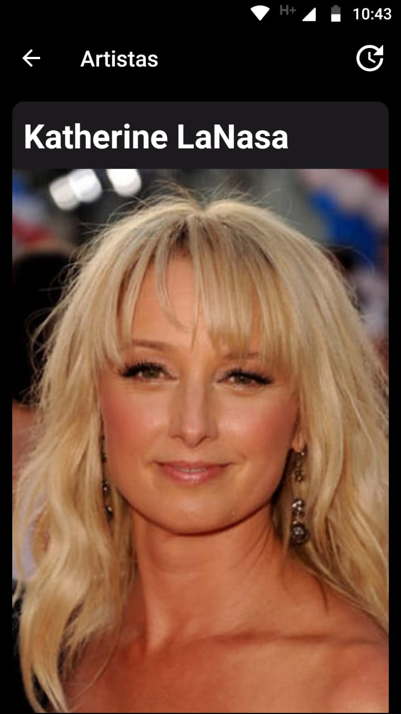

# Movies app consuming the TMDB api

* Kotlin - Multiplatform programming language.
* Retrofit - HTTP Client libraries for Android and Java.
* Dagger - Framework maintained by google that aims to perform dependency injection in Android and Java projects.
* Coroutines - Kotlin feature that makes it possible to write asynchronous codes more easily and sequentially, without using the Callback pattern.
* Glide - Android image loading and media management framework.
* Room - Lib able to perform data persistence with SQLite, using the ORM concept.

## Screens
| | | |
|:-------------------------:|:-------------------------:|:-------------------------:|
|  Home |   Artists| Movies|
| TV |